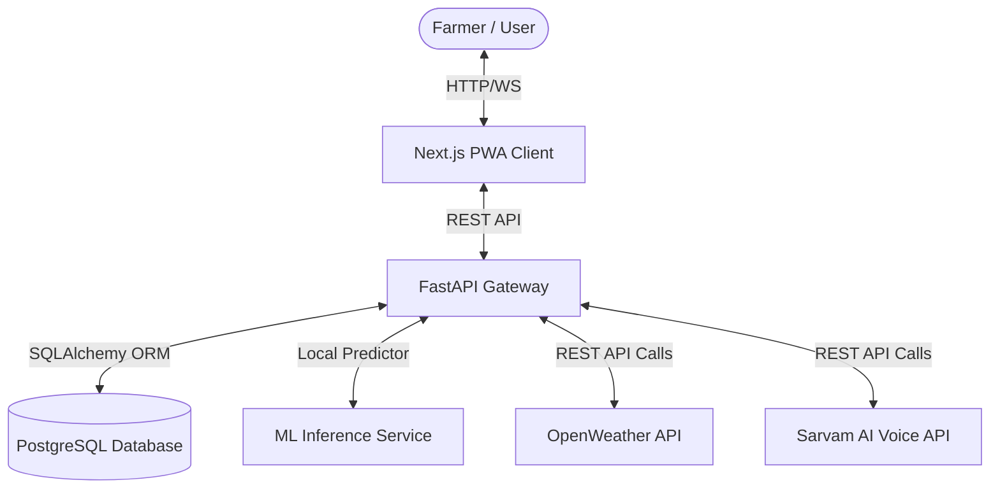

# System Architecture - AI-Based Irrigation Management System

This document outlines the high-level system architecture and data-flow diagrams for the **AI-Based Irrigation Management System for Predictive Water Scheduling and Crop Optimization**.

## 1. Component Block Diagram

## 2. Dynamic Irrigation Estimation Flow

1. **Telemetry Ingest:** Soil sensors publish volumetric moisture and telemetry records.
2. **Weather Retrieval:** Backend triggers daily weather forecasts for the coordinates via the **OpenWeather API**.
3. **Inference Pipeline:**
   - **Feature Vector:** Combine soil moisture, soil temperature, air temperature, relative humidity, and 24-hour forecasted precipitation.
   - **Prediction:** Pass vector to **Random Forest Classifier** to check if watering is required.
   - **Water Estimator:** If required, calculate the soil water deficit and estimate target volume (in Liters) for the specific crop variety.
4. **Alert Trigger:** If irrigation is critically needed, a notification log is saved and pushed to the Next.js frontend, or sent as a regional language voice alert via **Sarvam AI**.
